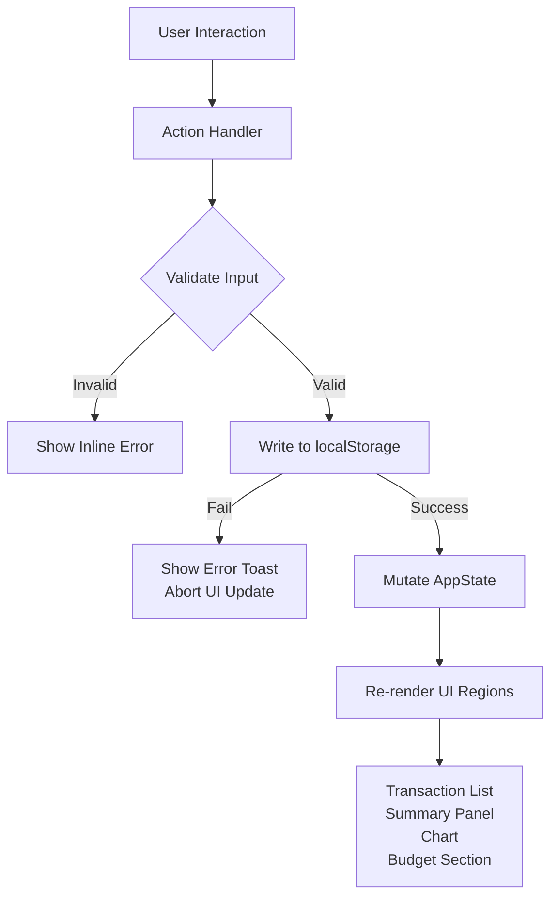

# Design Document: Expense & Budget Visualizer

## Overview

The Expense & Budget Visualizer is a fully client-side single-page application (SPA) built with HTML, CSS, and Vanilla JavaScript. It enables users to track income and expenses, categorize spending, set per-category budgets, visualize spending distributions with charts, and persist all data in `localStorage`. No server, framework, or build tool is required.

The architecture centers on a single `app.js` module that owns the application state and drives all UI updates reactively — every state-mutating action triggers a full UI re-render of only the affected region, keeping the logic simple and easy to reason about.

---

## Architecture

The application follows a **unidirectional data flow** pattern:

```
User Action → State Mutation → localStorage.save() → UI Re-render
```

All state lives in a single in-memory object (`AppState`). Every mutation first writes to `localStorage`, and only on success updates the in-memory state and re-renders the relevant UI regions. This guarantees that a page refresh never loses data.



### Key Architectural Decisions

- **No framework**: Plain DOM APIs keep the bundle at zero dependencies and satisfy TC-1.
- **Write-before-render**: `localStorage` is always written first. UI only updates on successful write, satisfying Requirements 9.5 and 9.6.
- **Reactive re-render**: After each state change the affected UI regions (`renderTransactionList`, `renderSummaryPanel`, `renderChart`, `renderBudgetSection`) are called. Granular region rendering avoids full-page repaints while staying simple.
- **Module pattern**: All logic is encapsulated in `js/app.js` using an IIFE or ES module to avoid polluting the global scope.

---

## Components and Interfaces

### File Structure

```
index.html
css/
  style.css
js/
  app.js
```

### HTML Structure (index.html)

```
<header>
  Theme Toggle Button
</header>

<main>
  <section id="summary-panel">        <!-- Summary Panel -->
  <section id="chart-section">        <!-- Chart Canvas/SVG -->
  <section id="budget-section">       <!-- Budget limits and indicators -->
  <section id="transaction-form">     <!-- Add Transaction Form -->
  <section id="custom-category">      <!-- Add Custom Category Control -->
  <section id="sort-controls">        <!-- Sort Control -->
  <section id="transaction-list">     <!-- Transaction List -->
</main>
```

### JavaScript Component Map (js/app.js)

| Function | Responsibility |
|---|---|
| `initApp()` | Bootstrap: load from localStorage, apply theme, render all regions |
| `loadState()` | Read and validate all data from localStorage |
| `saveState(key, value)` | Write a key to localStorage; throws on failure |
| `renderTransactionList()` | Render filtered + sorted transaction entries |
| `renderSummaryPanel()` | Compute and display income, expense, net balance |
| `renderChart()` | Draw spending chart (Canvas or SVG) |
| `renderBudgetSection()` | Display budget limits and spending indicators |
| `handleAddTransaction(e)` | Validate + save new transaction |
| `handleDeleteTransaction(id)` | Confirm + delete transaction |
| `handleSetBudget(category, limit)` | Validate + save budget limit |
| `handleAddCategory(name)` | Validate + save custom category |
| `handleSort(option)` | Update active sort option + re-render list |
| `handleThemeToggle()` | Switch theme + persist |
| `validateTransactionForm(data)` | Return array of field-level errors |
| `validateBudgetInput(value)` | Return error string or null |
| `validateCategoryName(name)` | Return error string or null |
| `applyTheme(theme)` | Toggle CSS class on `<html>` element |
| `computeSummary(transactions)` | Return `{ income, expenses, balance }` |
| `computeCategoryTotals(transactions)` | Return `Map<category, total>` |
| `getFilteredTransactions()` | Apply active filter + sort to AppState.transactions |

---

## Data Models

All data is stored in `localStorage` under the following keys:

### `ebv_transactions` — Array of Transaction objects

```js
{
  id: string,           // UUID v4 (crypto.randomUUID or Date.now().toString())
  type: "income" | "expense",
  amount: number,       // positive, max 2 decimal places, ≤ 999999999.99
  description: string,  // 1–100 characters
  category: string,     // must match a valid category name
  date: string          // ISO 8601 date string "YYYY-MM-DD", not in the future
}
```

### `ebv_budgets` — Object mapping category → budget limit

```js
{
  "Food": 300,
  "Transport": 150,
  "CustomCat1": 200
  // ...
}
```

### `ebv_categories` — Array of custom category name strings

```js
["CustomCat1", "Freelance", "Hobbies"]
```

### `ebv_theme` — String

```js
"light" | "dark"
```

### AppState (in-memory)

```js
const AppState = {
  transactions: [],       // Transaction[]
  budgets: {},            // Record<string, number>
  customCategories: [],   // string[]  (max 20)
  theme: "light",         // "light" | "dark"
  activeSort: null,       // null | "amount-asc" | "amount-desc" | "cat-az" | "cat-za"
  activeFilter: null      // future: filter state
};
```

### Built-in Default Categories

```js
const DEFAULT_CATEGORIES = [
  "Food", "Transport", "Utilities", "Entertainment",
  "Healthcare", "Shopping", "Education", "Other"
];
```

---

## Correctness Properties

*A property is a characteristic or behavior that should hold true across all valid executions of a system — essentially, a formal statement about what the system should do. Properties serve as the bridge between human-readable specifications and machine-verifiable correctness guarantees.*

### Property 1: Valid transaction always appears in the list

*For any* valid transaction input (non-empty fields, valid amount, valid date, valid category), after the add-transaction action completes, the transaction list SHALL contain an entry matching that input.

**Validates: Requirements 1.1, 1.2**

---

### Property 2: Invalid transaction never mutates state

*For any* transaction input that fails validation (empty required field, bad amount, future date, description > 100 chars), the transaction list, summary panel, and localStorage SHALL remain unchanged after the attempted add.

**Validates: Requirements 1.3, 1.4, 1.7, 1.8**

---

### Property 3: Summary panel reflects transaction set

*For any* set of transactions, the summary panel's displayed income total SHALL equal the sum of all income transaction amounts, and the displayed expense total SHALL equal the sum of all expense transaction amounts, with net balance equal to income minus expenses.

**Validates: Requirements 1.5, 2.4**

---

### Property 4: Transaction deletion is complete and consistent

*For any* transaction that exists in the list, after it is confirmed-deleted, it SHALL NOT appear in the transaction list, the summary panel SHALL be updated, and localStorage SHALL no longer contain that transaction.

**Validates: Requirements 2.2, 2.3, 2.4**

---

### Property 5: Budget limit persistence round-trip

*For any* valid budget limit value saved for any category, reading the budgets back from localStorage SHALL produce an equal numeric value for that category.

**Validates: Requirements 3.1, 3.2**

---

### Property 6: Spending indicator threshold invariant

*For any* category with a set budget limit, the spending indicator SHALL be displayed if and only if the sum of expense transactions for that category is greater than or equal to the budget limit.

**Validates: Requirements 3.4, 3.5, 3.6, 7.1, 7.3, 7.4, 7.5**

---

### Property 7: Chart segment coverage

*For any* non-empty set of expense transactions, every category that has at least one expense transaction SHALL have a corresponding labeled segment in the chart, and the sum of all segment percentages SHALL equal 100% (within floating-point tolerance).

**Validates: Requirements 4.1, 4.2, 4.4**

---

### Property 8: Custom category uniqueness

*For any* attempt to add a custom category whose name matches an existing category name (case-insensitive), the attempt SHALL be rejected and the category list SHALL remain unchanged.

**Validates: Requirements 5.4**

---

### Property 9: Custom category round-trip persistence

*For any* valid custom category that is successfully saved, it SHALL appear in all category selection controls immediately, and reading from localStorage SHALL return a list that includes that category name.

**Validates: Requirements 5.2, 5.3**

---

### Property 10: Sort order invariant

*For any* non-empty transaction list and any active sort option, every adjacent pair of transactions in the rendered list SHALL satisfy the ordering predicate for that sort option.

**Validates: Requirements 6.1, 6.2**

---

### Property 11: Theme persistence round-trip

*For any* theme selection (light or dark), after the toggle is activated and the page is reloaded, the active theme SHALL be the same as the one that was selected.

**Validates: Requirements 8.2, 8.3, 8.4**

---

### Property 12: Write-before-render safety

*For any* data-mutating action (add transaction, delete transaction, set budget, add category), if the localStorage write fails, the in-memory AppState and rendered UI SHALL remain unchanged from their pre-action state.

**Validates: Requirements 9.5, 9.6, 2.6, 5.5**

---

## Error Handling

### Validation Errors (inline)

All form validation errors are displayed inline, adjacent to the offending field, and cleared on the next submission attempt. The form is not submitted until all validations pass.

| Trigger | Error Location | Message Pattern |
|---|---|---|
| Empty required field | Below the field | "This field is required." |
| Amount non-numeric or ≤ 0 | Below amount field | "Enter a positive number." |
| Amount > 999,999,999.99 | Below amount field | "Amount exceeds maximum allowed value." |
| Amount > 2 decimal places | Below amount field | "Amount must have at most 2 decimal places." |
| Description > 100 chars | Below description field | "Description must be 100 characters or fewer." |
| Future date selected | Below date field | "Date cannot be in the future." |
| Budget limit invalid | Below budget input | "Enter a valid positive number up to 999,999,999.99." |
| Category name empty/too long | Below category input | "Name must be 1–50 characters." |
| Category name duplicate | Below category input | "A category with this name already exists." |
| 21st custom category attempt | Below category input | "Maximum of 20 custom categories reached." |

### System Errors (toast notifications)

Non-validation failures (localStorage write errors, corrupt data on load) surface as a dismissible toast notification at the top of the viewport.

| Trigger | Message |
|---|---|
| localStorage write failure | "Unable to save. Your changes could not be persisted." |
| Corrupt/malformed data on startup | "Previous data could not be loaded. Starting fresh." |

### Confirmation Prompts

Deletion uses a native `confirm()` dialog. If the user cancels, no action is taken.

---

## Testing Strategy

### Overview

This project uses a **dual testing approach**: example-based unit tests for specific behaviors and edge cases, plus property-based tests for universal invariants. The property-based test library is **fast-check** (JavaScript, browser-compatible via CDN or Node test runner).

Because the core logic (validation, state computation, sorting, chart data preparation) is pure or near-pure — taking data in and returning data out with no I/O — property-based testing is well-suited and cost-effective here. localStorage interactions are mocked in tests.

### Unit Tests

Unit tests verify specific concrete scenarios:

- Adding a transaction with each required field missing individually shows the correct error.
- Adding a transaction with a valid payload shows it in the list.
- Deleting a transaction removes it from the list and updates the summary.
- Setting a budget above current spending hides the spending indicator.
- Empty transaction list shows the empty-state message.
- Corrupt localStorage data on startup shows the notification and uses empty state.
- Theme defaults to "light" when no localStorage entry exists.
- The 21st custom category is rejected with the correct error.

### Property-Based Tests (fast-check)

Each test runs a minimum of **100 iterations**. Tests are tagged with the format:

> `Feature: expense-budget-visualizer, Property {N}: {property_text}`

| Property | Test Description |
|---|---|
| Property 1 | Generate random valid transaction inputs; after add, transaction appears in state |
| Property 2 | Generate random invalid inputs (empty fields, bad amounts, future dates); state is unchanged |
| Property 3 | Generate random sets of income/expense transactions; verify summary sums are correct |
| Property 4 | Generate random transaction sets; delete a random member; verify it's gone and summary is correct |
| Property 5 | Generate random valid budget values for random categories; save then reload from mock localStorage; values match |
| Property 6 | Generate random transaction sets and budget limits; spending indicator is shown iff total ≥ limit |
| Property 7 | Generate random expense transaction sets; verify chart data covers all categories, percentages sum to 100% |
| Property 8 | Generate random existing category lists and new name inputs; duplicates (case-insensitive) are rejected |
| Property 9 | Generate random valid category names; save then reload from mock localStorage; category is present |
| Property 10 | Generate random transaction lists; apply each sort option; verify pairwise ordering holds |
| Property 11 | Generate random theme selections; save then reload from mock localStorage; correct theme is restored |
| Property 12 | Simulate localStorage write failure; verify AppState and rendered output are unchanged |

### Test File Location

```
tests/
  unit/
    transactions.test.js
    budgets.test.js
    categories.test.js
    theme.test.js
    persistence.test.js
  property/
    transactions.property.test.js
    budgets.property.test.js
    categories.property.test.js
    sort.property.test.js
    theme.property.test.js
    persistence.property.test.js
```

Tests run with Node.js + a test runner (e.g., Vitest or Jest) using a mocked `localStorage` object.

### Accessibility Testing

- Verify color contrast ratios (4.5:1 body text, 3:1 large text) in both themes using a contrast checker.
- Manually verify keyboard tab order covers all form controls and interactive elements.
- Verify spending indicator uses both color and a text label/icon (not color-only).
- Test at viewport widths 320px, 768px, 1440px, and 2560px for layout integrity.
